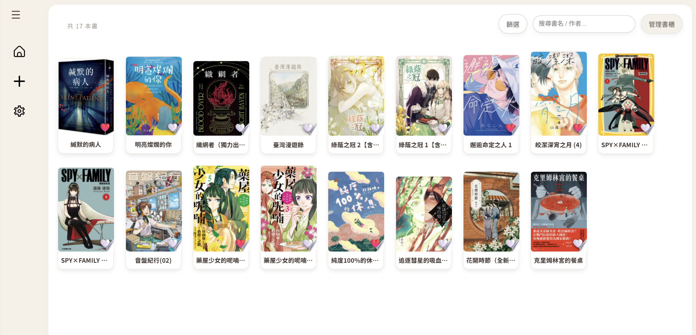
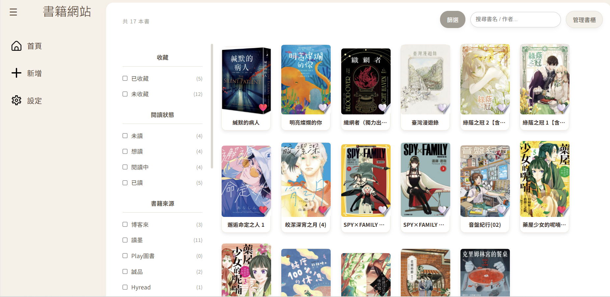
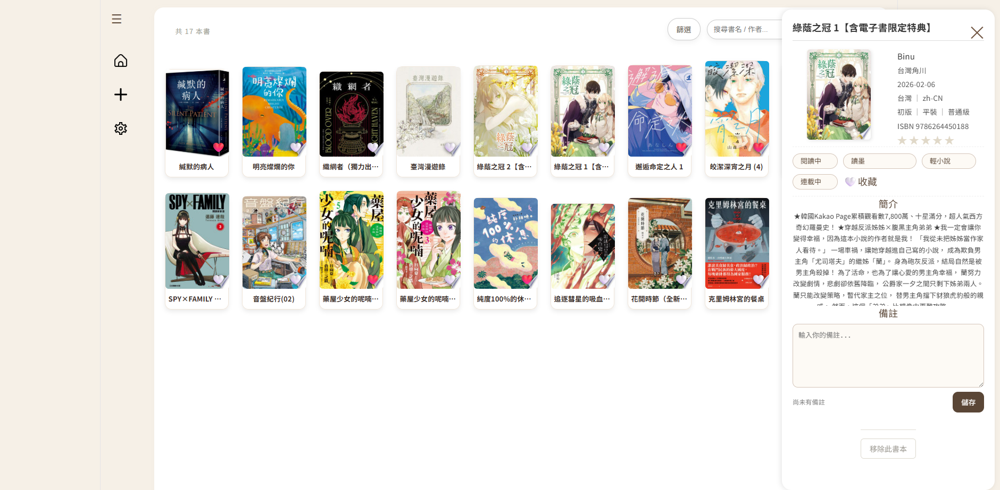
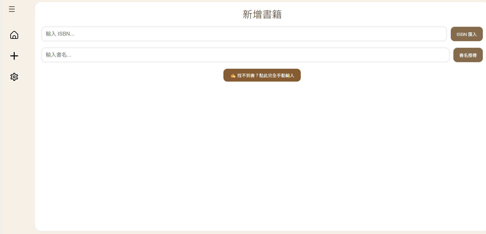
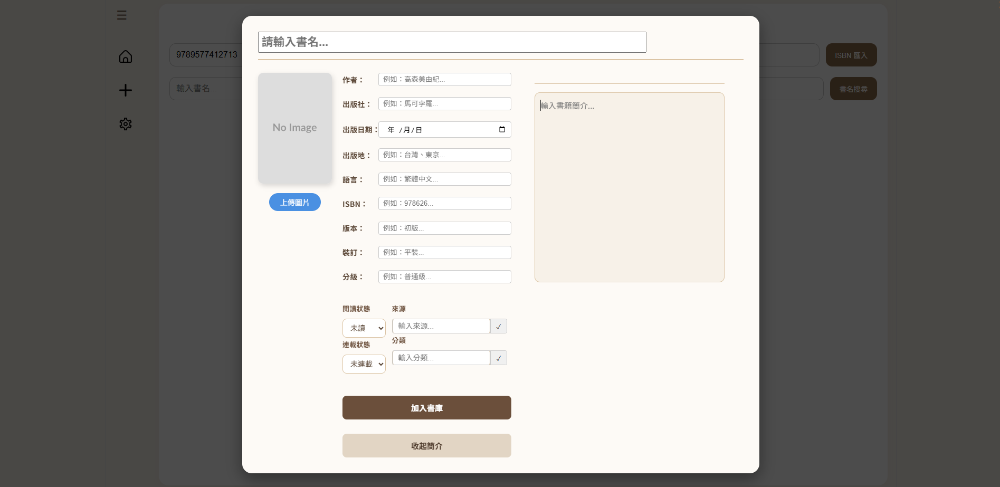
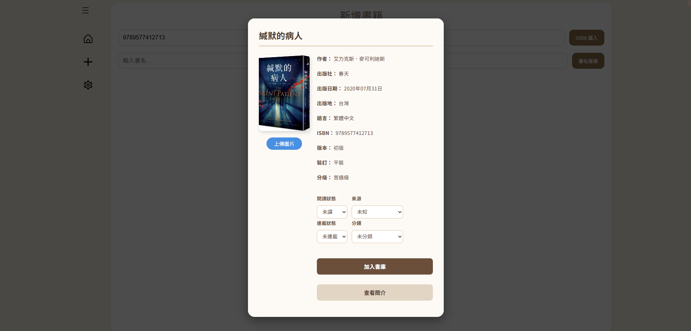
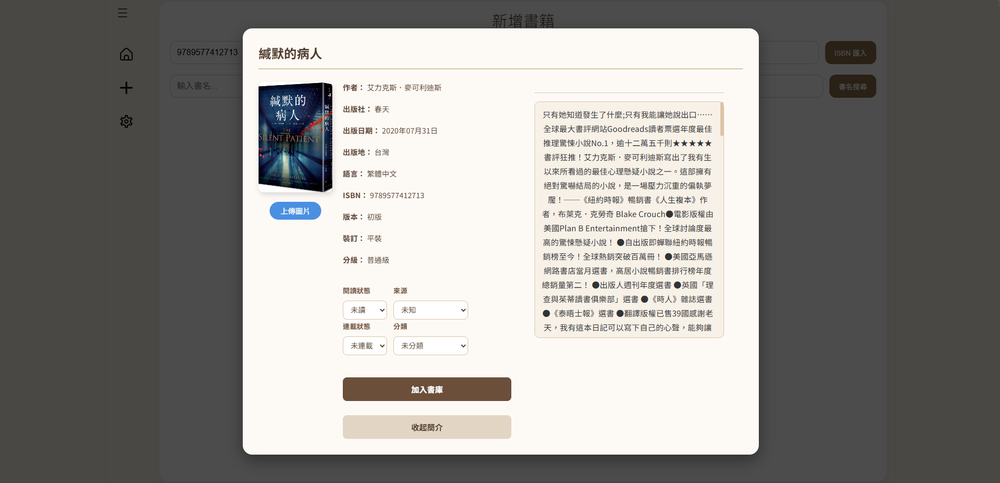
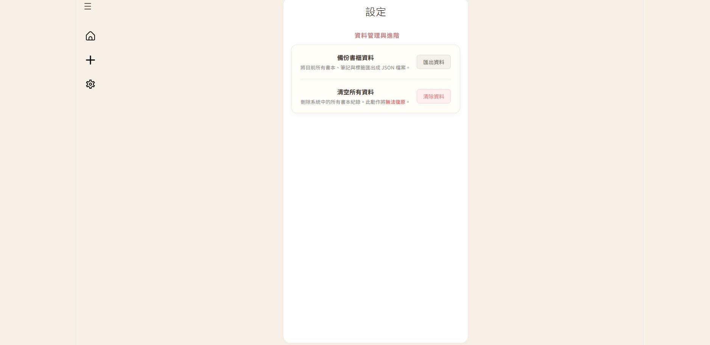

# Shelf Diary - 個人藏書管理系統

## 一、專案簡介

本專案是一個使用 React、Express 與 MongoDB 打造的「個人化書櫃管理系統」。使用者可以輕鬆記錄自己的閱讀狀態、書籍來源與分類。系統最大的特色在於整合了 Google Books API 與 ISBN 查詢，讓使用者能一鍵快速匯入書籍詳細資訊，大幅減少手動輸入的時間。同時具備完整的個人備註與評分功能，打造專屬於使用者的閱讀日記。

## 二、使用技術

* **前端:** React, Vite, 原生 CSS
* **後端:** Node.js, Express, cors
* **資料庫:** MongoDB, Mongoose
* **外部資源:** Google Books API, ISBN API

## 三、主要功能與特色

* **基礎核心功能 (CRUD):** 支援書籍的讀取 (GET)、新增 (POST)、更新 (PUT) 與刪除 (DELETE)。
* **特色功能 1：智慧書籍資料匯入 (外部 API 串接)**
  * 支援透過輸入 ISBN 碼，自動爬取書籍詳細資訊。
  * 支援透過 Google Books API 進行書名關鍵字搜尋，一鍵帶入封面、作者、出版社等欄位。
* **特色功能 2：多維度動態篩選與管理**
  * 支援以「閱讀狀態」、「書籍來源」、「類型」、「連載狀態」等多重條件進行交叉篩選。
  * 提供自訂「來源」與「分類」的擴充功能，不受限於預設選項。
* **特色功能 3：個人化閱讀日記**
  * 內建 1~5 星評分系統。
  * 每本書皆擁有獨立的「備註」功能，並會自動記錄最後更新時間，方便追蹤閱讀進度與心得。
* **特色功能 4：我的收藏**
  * 提供「愛心收藏」功能，可將特別喜歡的書籍獨立集中至收藏頁面快速瀏覽。

## 四、後端執行方式

cd backend

npm install multer

npm install

npm run dev

## 五、前端執行方式

cd frontend

npm install

npm run dev

## 六、環境變數設定方式

### 後端環境

在 backend 資料夾下建立 .env 檔案，參考 .env.example 填入連線資訊

### 前端

因為有使用 Google Books API Key，也需在 frontend 資料夾設置對應的 .env 同樣參考.env.example

## 七、API 路由表

| Method           | Path               | 功能說明                                       |
| :--------------- | :----------------- | :--------------------------------------------- |
| **GET**    | `/api/books`     | 取得書櫃中所有書籍資料                         |
| **POST**   | `/api/books`     | 新增一筆書籍資料                               |
| **PUT**    | `/api/books/:id` | 更新特定書籍資料（含狀態、備註、評分、收藏等） |
| **DELETE** | `/api/books/:id` | 將特定書籍從書櫃中移除                         |

## 八、MongoDB Schema 說明

| 欄位名稱           | 型態    | 預設值    | 說明                                       |
| ------------------ | ------- | --------- | ------------------------------------------ |
| `title`          | String  | 無 (必填) | 書名                                       |
| `author`         | String  | 無 (必填) | 作者                                       |
| `status`         | String  | 未讀      | 閱讀狀態 (特色欄位：未讀/想讀/閱讀中/已讀) |
| `source`         | String  | 未知      | 購買/借閱來源 (特色欄位：可自訂)           |
| `category`       | String  | 未分類    | 書籍分類 (特色欄位：可自訂)                |
| `serialStatus`   | String  | 連載中    | 連載狀態 (連載中/已完結)                   |
| `publisher`      | String  | 空字串    | 出版社                                     |
| `publishDate`    | String  | 空字串    | 出版日期                                   |
| `publishPlace`   | String  | 空字串    | 出版地點                                   |
| `isbn`           | String  | 空字串    | 國際標準書號 (會檢查格式)                    |
| `coverImage`     | String  | 空字串    | 封面圖片 URL                               |
| `description`    | String  | 空字串    | 書籍簡介                                   |
| `favorite`       | Boolean | false     | 是否加入我的收藏                           |
| `language`       | String  | 未知      | 語言 (例如：繁體中文、日文)                |
| `version`        | String  | 未知      | 版本 (例如：初版、二版)                    |
| `binding`        | String  | 未知      | 裝訂 (例如：平裝、精裝)                    |
| `grade`          | String  | 未知      | 分級 (例如：普通級、限制級)                |
| `rating`         | Number  | 0         | 星號評分 (0 ~ 5 分)                        |
| `note.text`      | String  | 空字串    | 個人閱讀備註內容                           |
| `note.updatedAt` | String  | 空字串    | 備註最後更新時間                           |

## 九、系統截圖與 Demo 

觀看完整操作流程：[前往 YouTube 觀看 SHELF DIARY Demo](https://youtu.be/bbcRTXcS0-M?si=_9FP4txt3P9Ls67J)

### 1.Home 頁面

**I. 書櫃總覽**
書櫃預設收合時的視窗。

**II. 快速篩選**
展開篩選（閱讀狀態、書籍來源、收錄狀態等）。

**III. 書籍詳細資訊與備註**
點擊書本即可展開側邊面板，查看完整書籍資訊、簡介，並可自由新增個人備註。

  

### 2.addBook 頁面

系統提供便捷的新增書籍介面，輸入 ISBN 或書名即可快速匯入書籍資訊，同時也支援手動輸入

**I. 空白表單**
提供乾淨的表單，支援手動輸入或自動帶入。

**II. 自動帶入書籍資訊**
輸入ISBN 或書名後，系統會自動抓封面、作者、出版社等欄位，並可選擇閱讀與連載狀態。

**III. 查看完整簡介**
點擊「查看簡介」可展開書籍的詳細說明內容。

  

### 3.Setting 頁面

可一鍵匯出所有書籍資料 JSON 檔或者一鍵清空所有書籍資料

## 十、組員分工

### CBE111031｜系統架構與後端開發

主要負責系統核心架構設計、後端開發與前後端整合，包含：

* MongoDB Schema 設計與資料模型建立
* RESTful API 開發（Create、Read、Update、Delete）
* Google Books API 查詢功能
* 書籍 CRUD 與資料流設計
* 多條件篩選與閱讀狀態管理邏輯
* 處理前後端資料同步
* 開發 BookModal 共用元件

**主要技術**

React、Express.js、MongoDB、RESTful API、Google Books API

---

### CBE111033｜使用者功能與介面開發

主要負責使用者功能開發、介面設計與使用體驗優化，包含：

* 書籍新增與表單驗證功能
* 設計 ISBN 查詢功能
* Add Book 手動輸入簡介與更改介面設計
* 完善全局版面配置 (Layout)、 Sidebar 以及 RWD 響應式佈局
* 提供圖片上傳、預覽與封面顯示功能
* 書籍詳細資訊面板共用元件開發 
* UI/UX 優化與頁面互動設計

**主要技術**

React Hooks、介面設計、ISBN 爬蟲、表單驗證、Image Upload 

---
 ### Contribution Overview

| 模組 | CBE111031 (核心與資料流) | CBE111033 (介面與體驗) | 相關檔案 (涵蓋前後端) |
| :--- | :--- | :--- | :--- |
| **後端架構與 API** | MongoDB Schema 設計、RESTful API 開發 | — | `backend/models/Book.js` `backend/routes/bookRoutes.js` `backend/server.js` |
| **書籍資料 CRUD** | 建立資料流與前後端同步機制 | 書籍新增流程與表單驗證 | `api/bookApi.js` `hook/useBookForm.js` `backend/routes/bookRoutes.js` |
| **外部 API 串接** (Google Books/ISBN) | API 串接邏輯與非同步處理 (`async/await`) | ISBN 搜尋介面 | `api/searchBookApi.js` `hook/useSearchBooks.js` `components/SearchBookInputs.jsx` |
| **Add Book 頁面** | 開發 `BookModal` 共用元件,加入自訂欄位功能並完成資料狀態傳遞 |  `BookModal`手動輸入簡介與更改介面設計 | `pages/AddBook.jsx` `components/BookModal/*` |
| **Home 頁面** | 開發多條件、可複選之動態篩選模式、首頁書籍網格 (Grid) 排版與資料渲染  | 單一書籍卡片視覺設計、篩選面板介面優化、Sidebar 導覽列 | `pages/Home.jsx` `components/Card.jsx` `data/booksStorage.js` |
| **書籍詳細資訊面板** | 面板資料前後端同步、狀態即時更新機制 | 開發側邊面板共用元件,包含標籤、收藏與備註編輯功能 | `components/BookDetailPanel.jsx` `components/panel/*` |
| **收藏與筆記系統** | 收藏/筆記狀態 API 串接與資料庫更新 | 愛心按鈕互動切換、UI 狀態同步顯示 | `components/Card.jsx` `components/BookDetailPanel.jsx` `api/bookApi.js` |
| **手動新增圖片管理** | — | `FormData` 資料處理、支援外部連結、圖片UI介面, 包含上傳按鈕、圖片即時預覽 | `components/BookModal/BookModalInfo.jsx` `backend/routes/bookRoutes.js` |
| **Setting 頁面** | 實作「清空資料」與「JSON 資料匯出」邏輯 | — | **`pages/Setting.jsx`** `api/bookApi.js` `backend/routes/bookRoutes.js` |

> 註：部分檔案由兩位成員共同開發與維護。A 同學主要負責系統架構、資料流設計、API 串接；B 同學主要負責功能實作、使用者互動與介面優化。
以下檔案由兩位成員共同開發：

#### 主要共同維護檔案

* `frontend/src/components/components/panel/*`
* `frontend/src/pages/Home.jsx`
* `frontend/src/components/BookModal/*`
* `backend/routes/bookRoutes.js/*` 
* `frontend/src/App.jsx/*` 

